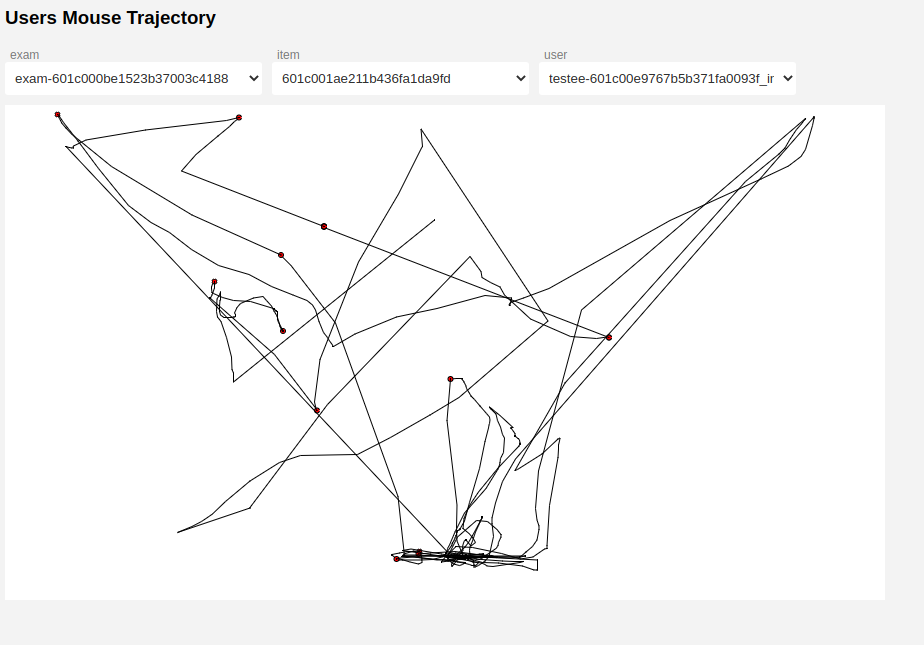

# Animation of (Mouse) Trajectories

This tool visualize spatio-temporal data.


----
## setup

### set up a local server

P5.js requires a local server.  I can recommend node.js `http-server`. But every other is fine. 

1) Download and Install [node.js](https://nodejs.org/en/download/) 

2) Open a terminal or command prompt (on Windows you might need to open the command prompt as admin)

3) In the terminal type:
```
npm install -g http-server
```

From then on just cd to the folder that has the files you want to serve and type

```
http-server
```

Then point your browser at `http://localhost:8080/`


Then open the  `userSession.html` to see the animations.

----

## Use your own data

- Copy your data as `.csv` files into the [data](data/) folder
- Currently, the tool need a file with a list of the file names, to make a selection possible. Upload a `.txt` file with all files name in [assets](assets/)  
- change the strings in the `preload` function in [sketch.js](sketch.js) accordingly 
- change the name of the columns for x, y throughout the files [sketch.js](sketch.js) and [aux_func.js](aux_func.js)
- the given demo data encompasses mouse data. Therefore the canvas size is been changed. You might want to change this. 
